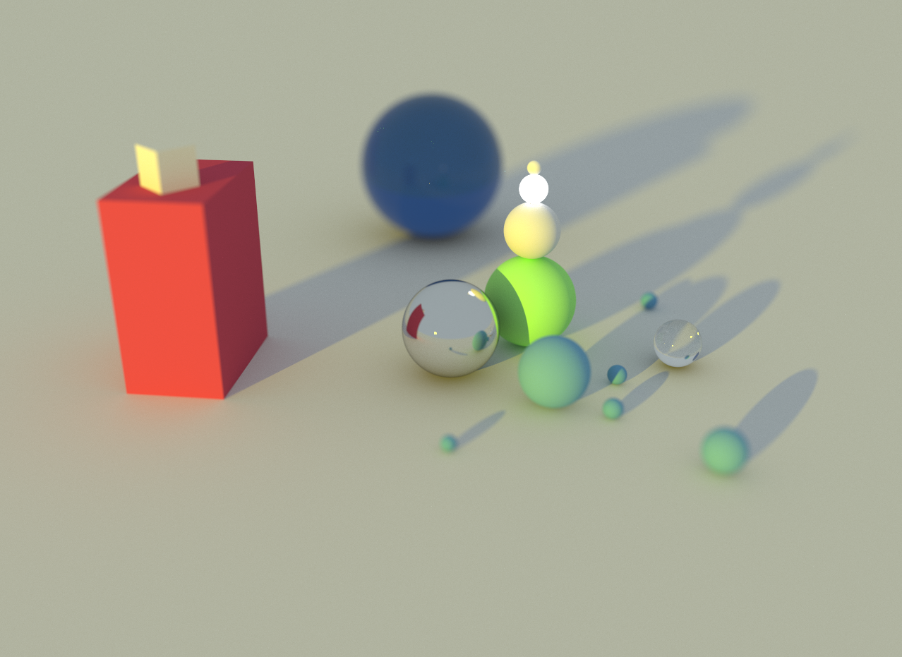
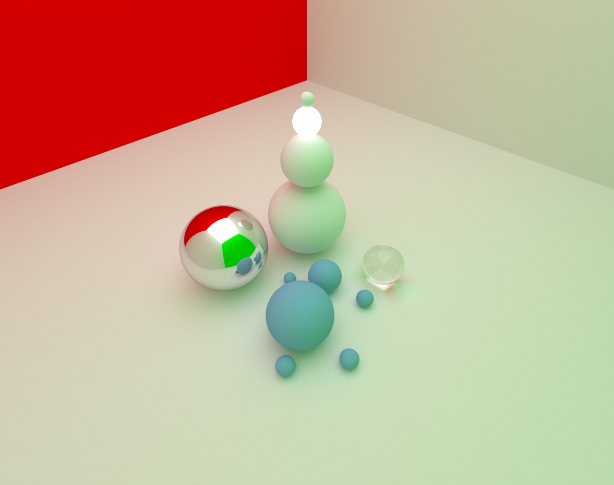
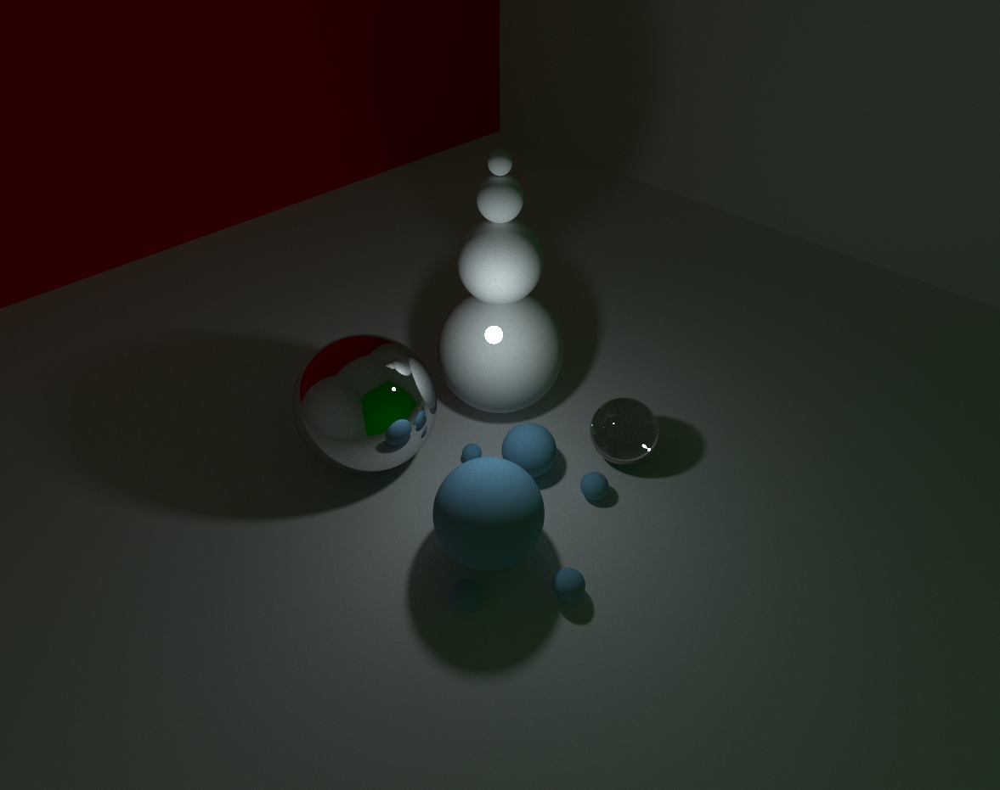
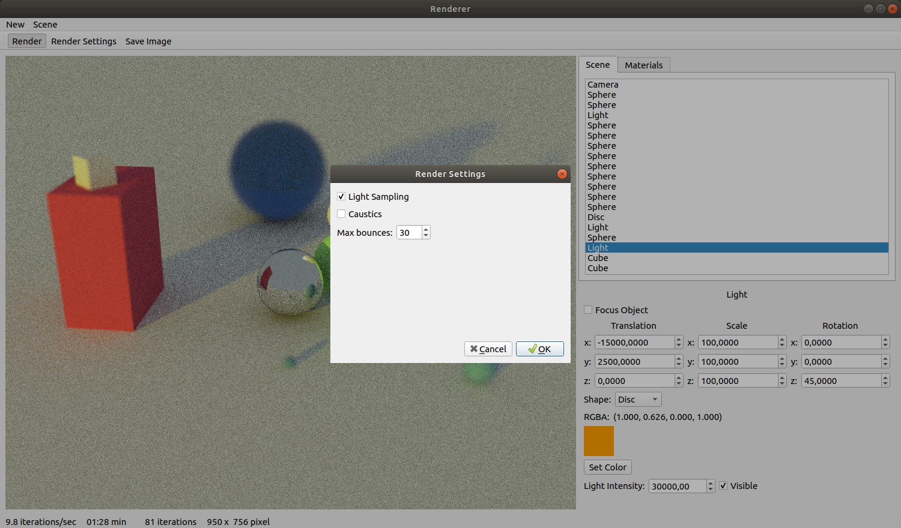
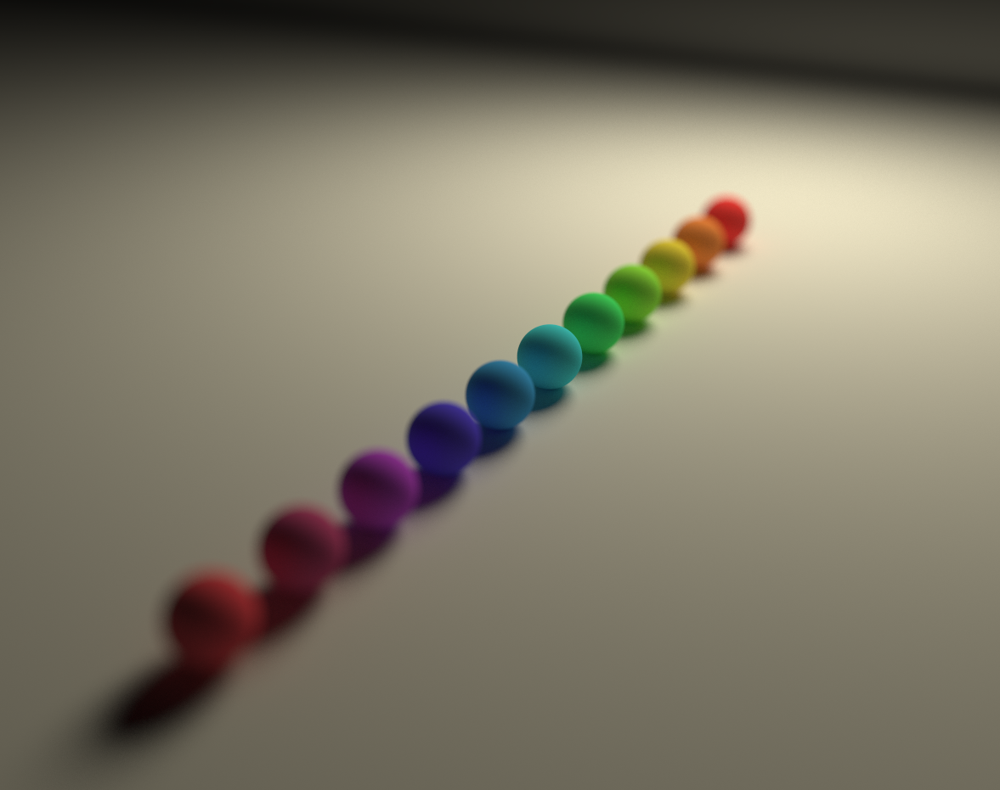
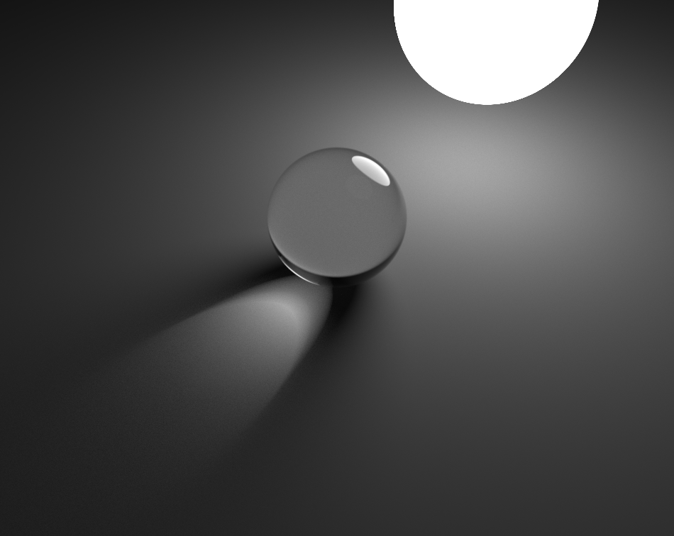
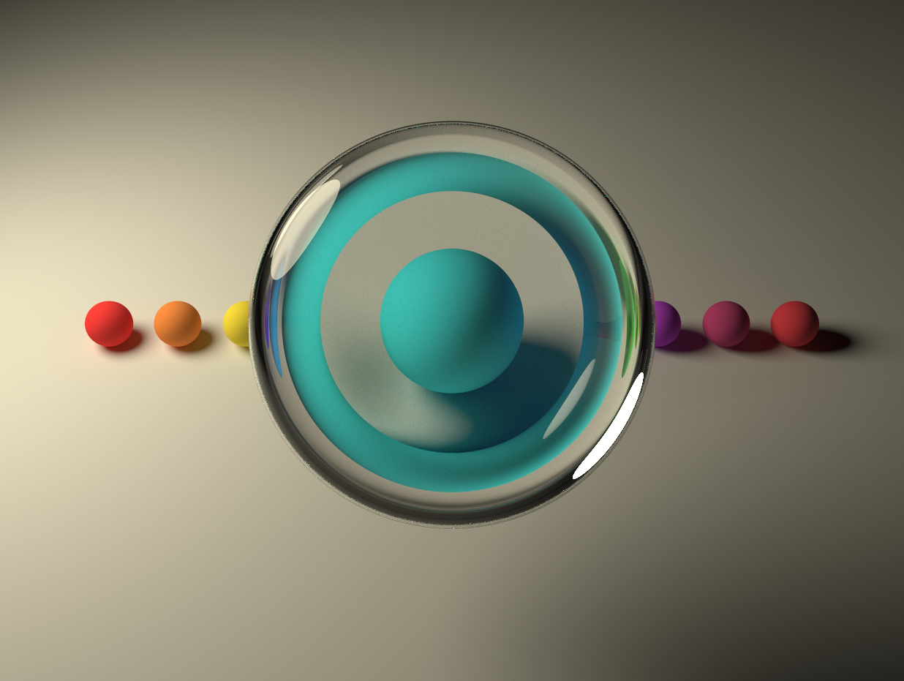
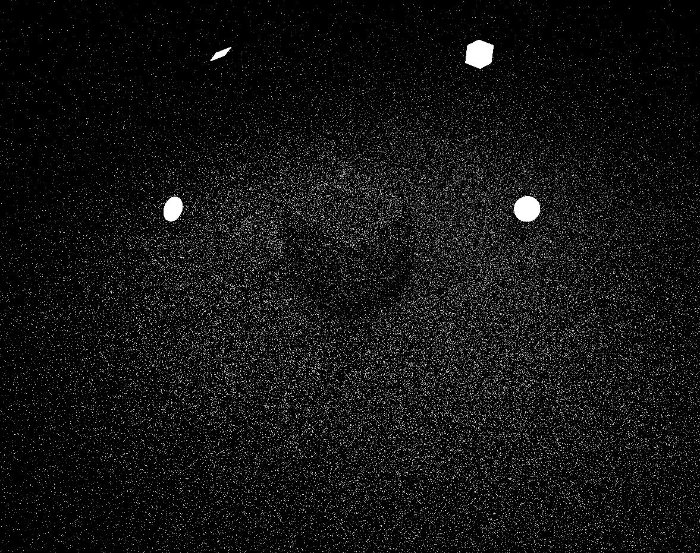
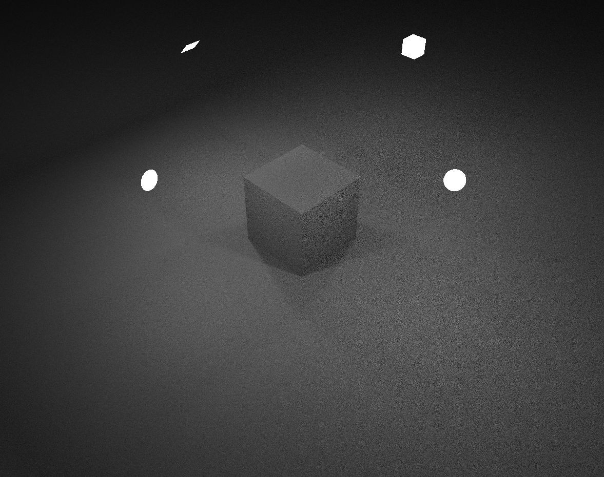
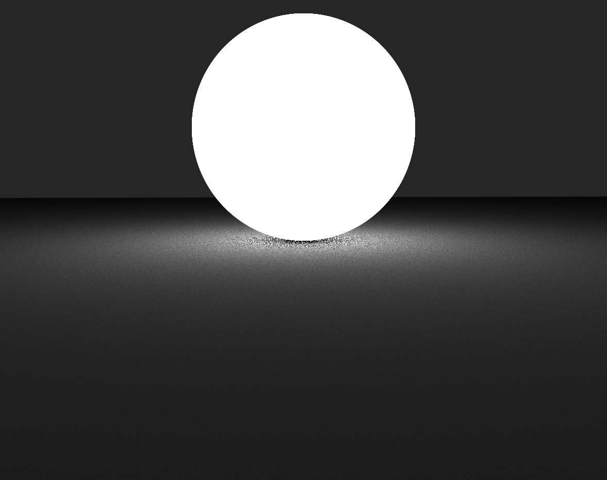

# CUDA Pathtracer
**A physically based renderer using CUDA**

*Scenes inspired by [Yining Karl Li's and Peter Kutz' GPU Pathtracer](https://www.yiningkarlli.com/projects/gpupathtracer.html)*

## Overview
In October 2018 I started a personal project to implement a CUDA enabled physically based path tracer with a simple 3D editor. The application allows users to interactively place objects and lights in a scene and render them using GPU acceleration.

### Features
* GUI editor with OpenGL viewport allows interaction with the scene
* Multiple geometric primitive shapes (spheres, cubes, planes, discs) for scene objects and light emitters
* Saving and loading of scenes and saving of images
* Materials can be created, edited and assigned to the objects directly in the editor
* Diffuse and specular material
* Camera with depth of field and control over focus and aperture
* Anti-aliasing and stratified sampling
* Light sampling achieves massively accelerated convergence for small or far light sources
* Render settings in the editor

## License

For the intersection, sampling and material evaluation routines I adapted code sections from [pbrt, Version 3](https://www.pbrt.org/) [(source code)](https://github.com/mmp/pbrt-v3) (Pharr, Jakob, Humphreys, 2016) which is why this project is available under the [BSD license](https://github.com/mmp/pbrt-v3/blob/master/LICENSE.txt).

## Technology

I used Python and [Qt for Python](https://www.qt.io/qt-for-python) for the GUI and C++ and [CUDA 9](https://developer.nvidia.com/cuda-90-download-archive) for the renderer. To use the renderer within the python application I wrapped my C++ renderer library using [Cython](https://cython.org/).

I developed the application on a system with Ubuntu 18.04, an Nvidia GeForce GTX 1070 Ti as main compute GPU, a GeForce GT 1030 for OpengL and display GPU and an Intel i7 8700 with 16GB Ram. All screenshots and animations were created on that system.

## Editor

The editor has basic functionality for placing and transforming objects and lights in the scene, creating and assigning materials, controlling the camera viewpoint in the OpenGL viewport and starting the renderer. Objects and materials are listed in the *Scene* and *Materials* tabs respectively and can be selected for further editing or deletion. Scene changes can be made during an active render and will be reflected in the progressively updated viewport. The editor has controls for enabling and disabling caustics and light sampling as well as for setting the maximum number of bounces. Light shape visibility during rendering can be set on a per light basis.

## Depth of Field

The extent of the focus area can be set with aperture and focus distance controls in the GUI. The effect is achieved by sampling the camera ray origin over a disc and setting its direction so that it would intersect the ideal ray going through a pinhole opening at the focus distance.

## Stratified Sampling

By randomly jittering the position of an image sample within a pixel, anti-aliasing can be reduced at the cost of increased noise. To limit the noise, the camera has controls for stratified sampling, i.e. the level of subdivisions for a pixel. Subdividing the pixel area into strata and sampling randomly within each stratum should theoretically reduce noise by encouraging pixels to spread evenly over the entire pixel, instead of possibly clumping in a small image region. However, the improvement is only noticable if camera blur is the main source of noise in an image.

## Specular Reflection and Refraction

The renderer is capable of rendering fresnel modulated specular reflection and refraction. The rendering of caustics is a direct result of specular materials.

## Light Sampling

A path tracer that only relies on random outgoing directions to shade points on surfaces with diffuse materials will produce noisy images if the light sources in the scene are small or far away from a shading point (i.e. the light source has a low probabilty of being hit by a random outgoing direction). Directly sampling the direct lighting contribution for diffuse points can increase the convergence speed of a render enormously. To enable light sampling the renderer has to sample a point on a light source and then cast a shadow ray towards that point, only adding the radiance contribution if the ray between the shading point and the point on the light source is unoccluded.

*Approximately equal time comparison between no light sampling (top) and enabled light sampling (bottom)*

The quality of the light shape sampling method can have a great effect on the noise with respect to that light source. A good sampling algorithm will only sample points on the shape which can be potentially seen from the shading point (i.e. that are not occluded by the emitter shape itself, like points on the back of a sphere are for example). For the sphere and cube emitter shape sampling I uniformly sample over the entire surface area of the shape, which is not optimal. The above comparison shows all light shapes in one scene. The areas lit by the sphere and cube lights show much higher variance than those lit by the disc and plane lights, since there is no self occlusion with the latter shapes. The performance of sphere light sampling is especially bad when the light is very close to the shading point, since in this case only a fraction of the surface is visible from the point. Still for most use cases the improvement over an image without light sampling is enourmous.

*Light sampling with a spherical emitter. Note how areas closer to the light source resolve much less efficiently.*

## Parallel Architecture

Rendering is a task with great inherent potential for parallel computing. Each pixel to be rendered can be calculated independently of all other pixels. However, a naive implementation that parallelizes over pixels would waste lots of parallel potential since the number of bounces in a path can greatly vary between pixels. Some camera rays for example might not intersect with any scene object and therefore terminate after one raycast while other paths could require up to the maximum bounce depth. In a single kernel implementation of path tracing there is further loss of parallel potential if threads within a warp have to execute different shaders, different types of raycasts (full intersection or simple shadow ray) or might have to generate camera rays.

To alleviate the effect of ray path length divergence the design of my renderer follows the implementation of Laine, Karras and Aila (2013) in *Megakernels Considered Harmful: Wavefront Path Tracing on GPUs*. I seperate the rendering code into individual kernels for:
* main logic
* path and camera ray generation
* diffuse materials
* specular materials separated into
    * specular reflection
    * specular transmission
* raycasts
* shadow raycasts

Since these kernels might have to be run several times for an iteration (one pixel sample) to finish, path state is kept in structures in global GPU memory. Evaluation requests across different kernels for a specific path are done via queues, which are simply arrays storing path indices. Unique queue request indices are retrieved by incrementing a global counter for each queue atomically. The kernel responsible for initializing the path states runs once for one iteration.
